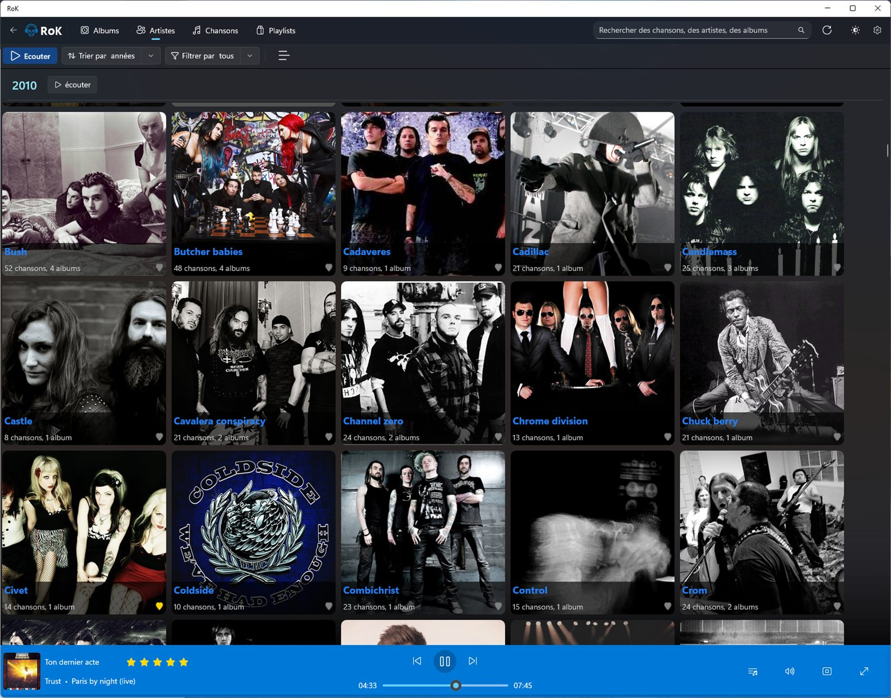
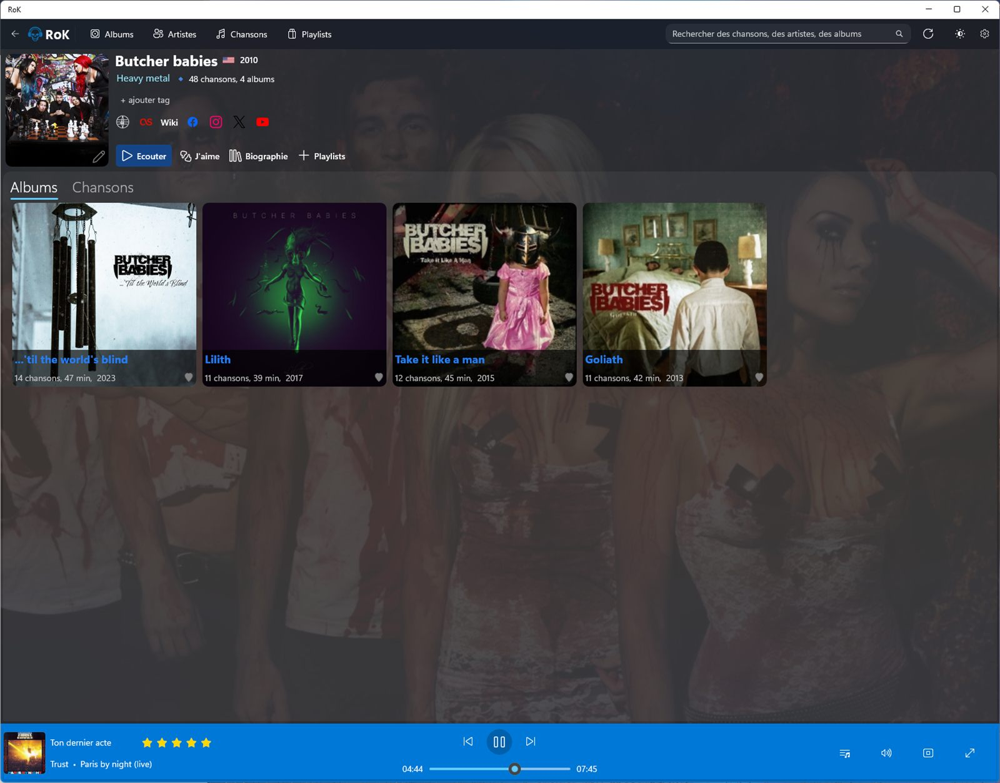
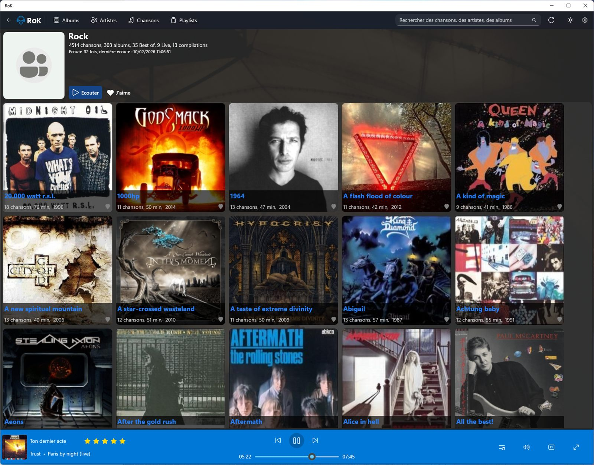
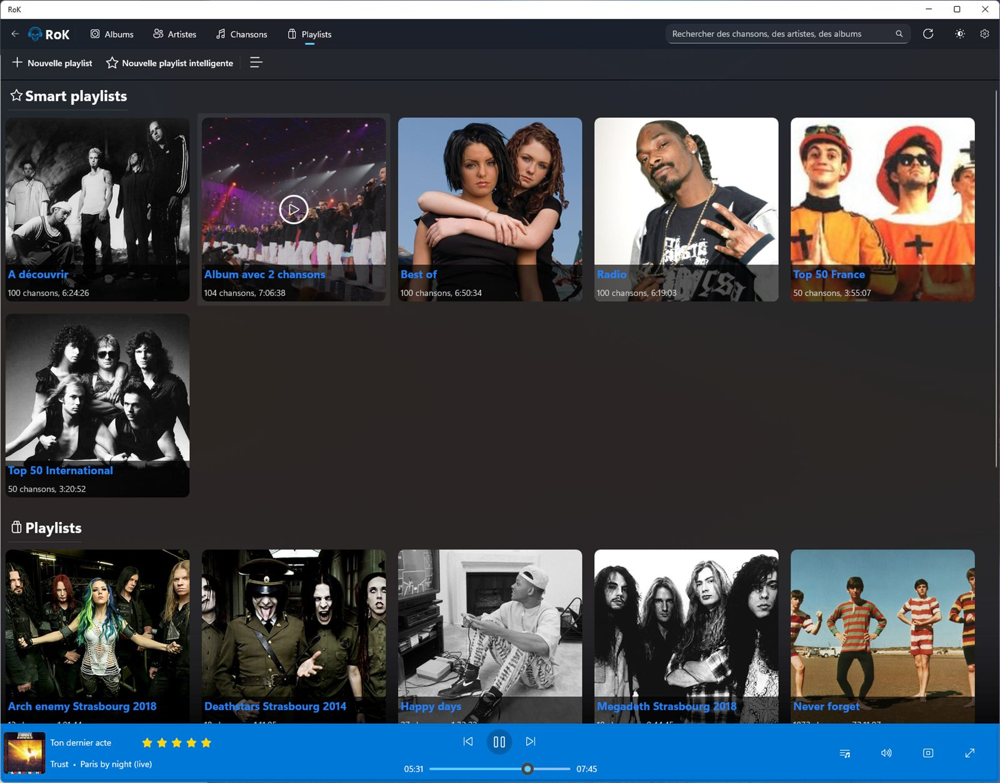

[🇬🇧 English](README.md) | [🇫🇷 Français](README.fr.md)


# 🎵 Rok

**Rok** est un lecteur de musique moderne pour Windows, conçu avec les dernières technologies Microsoft.

## 📖 À propos

Rok est une application de bureau Windows permettant de gérer et d'écouter votre collection musicale locale. Développée avec .NET 10 et WinUI 3, elle offre une interface fluide et moderne qui s'intègre parfaitement à Windows 11.

<p align="center">
  
</p>

## ✨ Fonctionnalités

- 🎵 **Lecture audio** — Moteur basé sur NAudio avec gestion de la file d'attente, fondu enchaîné et minuteur de veille
- 📚 **Gestion de bibliothèque** — Navigation par albums, artistes, genres et playlists
- 🧠 **Playlists intelligentes** — Playlists dynamiques construites à partir de règles
- 🔍 **Recherche** — Recherche rapide dans toute votre collection
- ✏️ **Édition de métadonnées** — Modification des tags, pochettes et informations des pistes
- 🖼️ **Enrichissement automatique** — Récupération des pochettes, photos d'artistes et fonds d'écran via l'API RoK Music
- 🎤 **Paroles** — Affichage des paroles, avec traduction optionnelle
- 📻 **Radios internet** — Écoute de stations via Radio Browser
- 📊 **Statistiques** — Analyses et indicateurs sur vos écoutes
- 🕒 **Historique d'écoute** — Suivi de ce que vous écoutez au fil du temps
- 🎮 **Intégration Discord** — Affichage de votre écoute en cours sur Discord
- 🎛️ **Contrôles média Windows** — Intégration aux System Media Transport Controls (SMTC)
- 🔗 **Liens Last.fm** — Accès rapide aux pages artiste et album
- 🌓 **Thèmes** — Support des modes clair et sombre
- 🎯 **Mode compact** — Vue minimale du lecteur

## 📸 Captures d'écran

<table>
  <tr>
    <td width="50%"><br><sub><b>Artistes</b></sub></td>
    <td width="50%"><br><sub><b>Fiche artiste</b></sub></td>
  </tr>
  <tr>
    <td width="50%"><br><sub><b>Fiche genre</b></sub></td>
    <td width="50%"><br><sub><b>Playlists intelligentes</b></sub></td>
  </tr>
  <tr>
    <td colspan="2" align="center"><br><sub><b>Lecture en cours</b></sub></td>
  </tr>
</table>

## 🛠️ Technologies

### Stack technique

- **.NET 10.0** — Framework moderne et performant
- **C# 13** — Dernières fonctionnalités du langage (`LangVersion=preview`)
- **WinUI 3 / Windows App SDK 2.2** — Framework d'interface natif Windows et APIs de la plateforme
- **NAudio** — Moteur de lecture audio
- **SQLite** + **Dapper** — Base de données locale et micro-ORM haute performance
- **TagLibSharp** — Lecture/écriture des métadonnées audio
- **CleanArch.DevKit.Mediator** — Médiateur source-generé (CQRS, validation, pattern Result, messagerie)
- **CommunityToolkit.Mvvm** — MVVM source-generé (objets observables et commandes)
- **Serilog** — Journalisation structurée
- **DiscordRichPresence** — Rich Presence Discord

### Architecture

Le projet suit les principes de **Clean Architecture**, avec une direction de dépendance stricte `Presentation → Application → Domain`. `Infrastructure` et `Import` se branchent sur les bords — les couches internes ne référencent jamais les couches externes.

```
src/
  Rok.Domain/           Entités, enums, interfaces de repositories. Zéro dépendance.
  Rok.Shared/           Helpers transverses (collections, extensions, validation).
  Rok.Application/      Use cases (CQRS via CleanArch.DevKit.Mediator), services
                        applicatifs (PlayerService, PlaylistService…), DTOs, messages découplés.
  Rok.Infrastructure/   Repositories Dapper + SQLite, migrations de schéma, IO de tags TagLibSharp,
                        moteur de lecture NAudio, clients HTTP (Last.fm, RoK Music, Translate,
                        Radio Browser), Rich Presence Discord, télémétrie, Serilog.
  Rok.Import/           Pipeline de scan et d'import de la bibliothèque, exécuté sur un thread pool
                        pour garder l'interface réactive.
  Presentation/ (Rok)   Tête WinUI 3 : Pages, ViewModels, Dialogs, Converters, Services.
```

#### Couches et responsabilités

**🎨 Presentation**
- Interface utilisateur WinUI 3 avec XAML
- ViewModels implémentant le pattern MVVM (CommunityToolkit.Mvvm)
- Binding de données bidirectionnel et navigation entre les pages
- Gestion des thèmes et styles

**💼 Application (Rok.Application)**
- Use cases métier (requêtes et handlers CQRS)
- Orchestration de la logique applicative
- DTOs pour le transfert de données
- Messagerie découplée entre composants
- Interfaces de services

**🏛️ Domain (Rok.Domain)**
- Entités métier (Album, Artist, Track, Playlist, Genre)
- Règles métier et validations
- Interfaces de repositories
- Modèle de domaine indépendant de l'infrastructure

**📦 Infrastructure (Rok.Infrastructure)**
- Implémentation des repositories avec Dapper sur SQLite
- Migrations de schéma
- Lecture/écriture de métadonnées avec TagLibSharp
- Moteur de lecture NAudio
- Clients HTTP, intégration Discord, télémétrie et journalisation Serilog

**📥 Import (Rok.Import)**
- Scan de la bibliothèque et pipeline d'import des albums/artistes/genres/pistes

**Patterns utilisés :**
- **MVVM** (Model-View-ViewModel) — Séparation UI/logique
- **CQRS** (Command Query Responsibility Segregation) — Séparation lecture/écriture
- **Mediator Pattern** — Communication découplée entre composants
- **Repository Pattern** — Abstraction de l'accès aux données
- **Dependency Injection** — Inversion de contrôle avec Microsoft.Extensions.DependencyInjection
- **Result Pattern** — Gestion explicite des succès/échecs sans exceptions

## 📋 Prérequis

- Windows 10 version 1809 (build 17763) ou supérieur
- Windows 11 recommandé pour une expérience optimale

## 📧 Contact

Mickaël François - [@mickaelfrancois](https://github.com/mickaelfrancois)

⭐ Si vous aimez ce projet, n'hésitez pas à lui donner une étoile sur GitHub !
