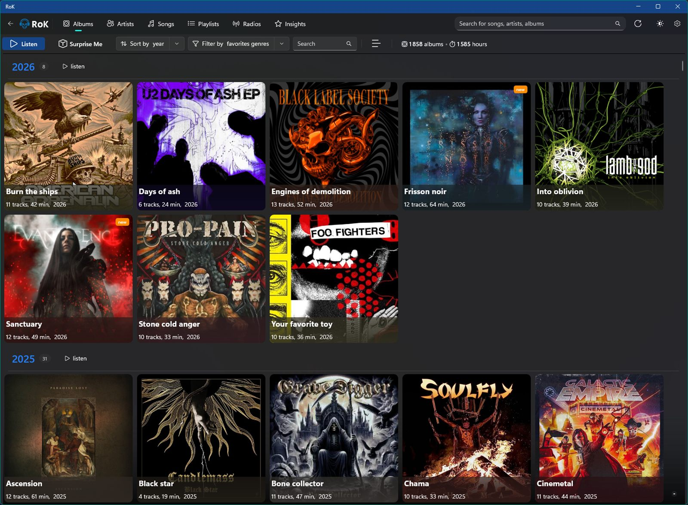
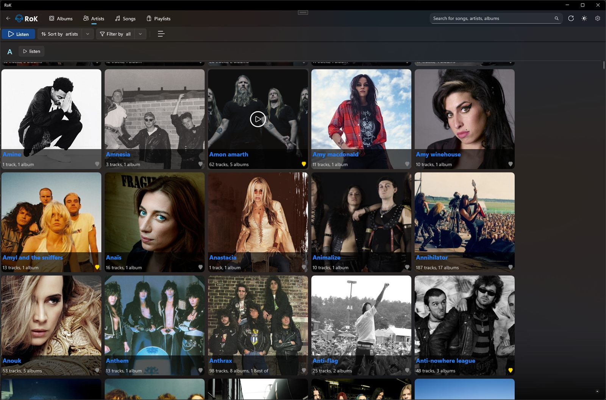
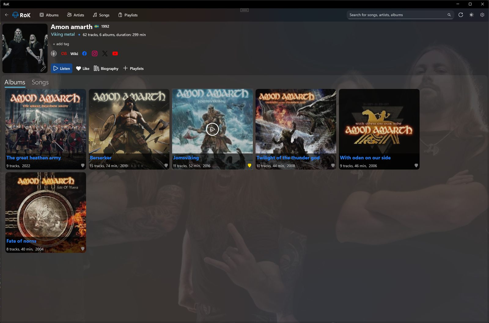
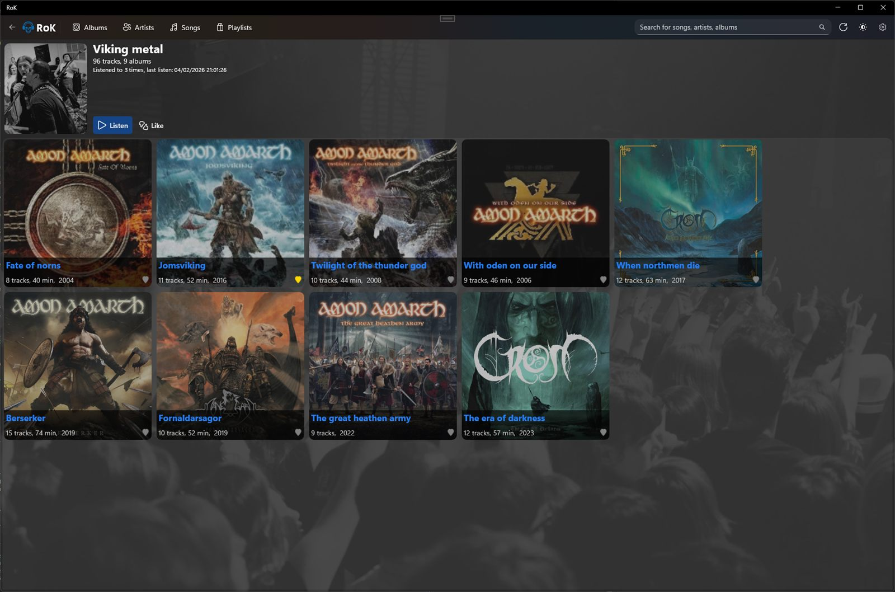
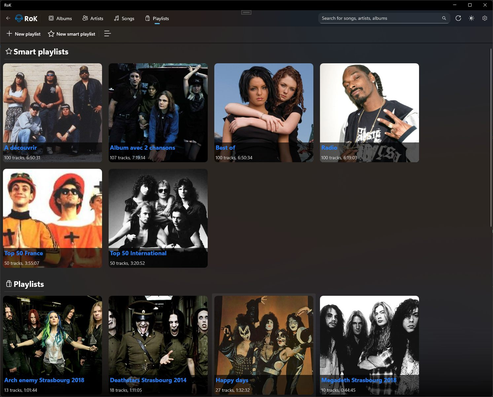
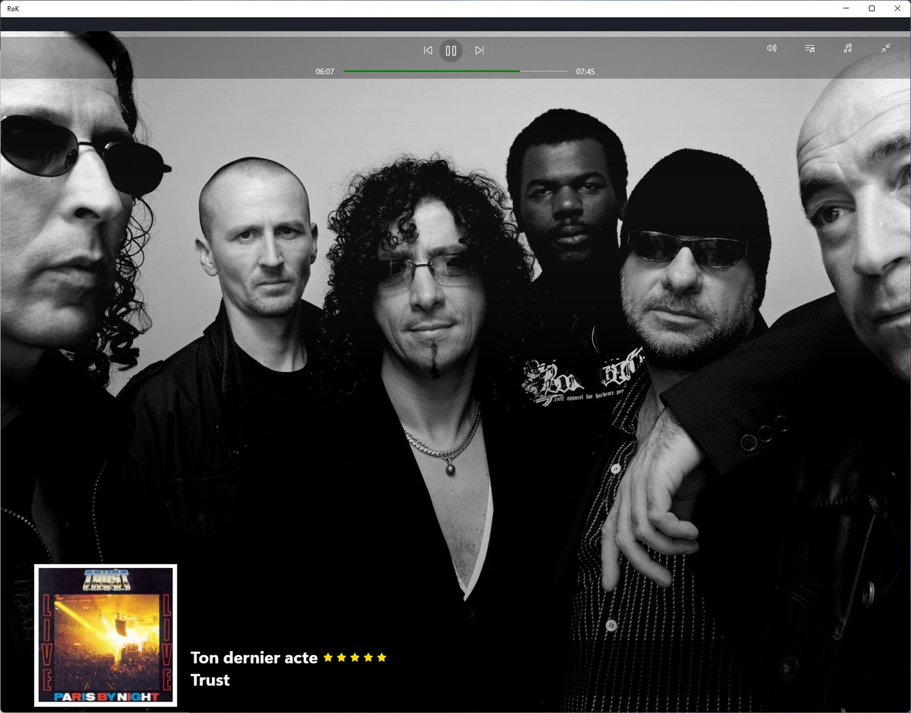

[🇬🇧 English](README.md) | [🇫🇷 Français](README.fr.md)


# 🎵 Rok

**Rok** is a modern music player for Windows, built with the latest Microsoft technologies.

## 📖 About

Rok is a Windows desktop application for managing and playing your local music collection. Developed with .NET 10 and WinUI 3, it offers a fluid and modern interface that seamlessly integrates with Windows 11.

<p align="center">
  
</p>

## ✨ Features

- 🎵 **Audio Playback** — NAudio-powered engine with queue management, crossfade, and a sleep timer
- 📚 **Library Management** — Browse by albums, artists, genres, and playlists
- 🧠 **Smart Playlists** — Dynamic playlists built from rules
- 🔍 **Search** — Quick search across your entire collection
- ✏️ **Metadata Editing** — Modify tags, covers, and track information
- 🖼️ **Automatic Enrichment** — Fetch album covers, artist photos, and backdrops from the RoK Music API
- 🎤 **Lyrics** — Display song lyrics, with optional translation
- 📻 **Internet Radio** — Stream stations via Radio Browser
- 📊 **Insights** — Statistics and analytics about your listening
- 🕒 **Listening History** — Track what you play over time
- 🎮 **Discord Integration** — Show your current listening activity on Discord
- 🎛️ **Windows Media Controls** — System Media Transport Controls (SMTC) integration
- 🔗 **Last.fm Links** — Quick access to artist and album pages
- 🌓 **Themes** — Light and dark mode support
- 🎯 **Compact Mode** — Minimal player view

## 📸 Screenshots

<table>
  <tr>
    <td width="50%"><br><sub><b>Artists</b></sub></td>
    <td width="50%"><br><sub><b>Artist page</b></sub></td>
  </tr>
  <tr>
    <td width="50%"><br><sub><b>Genre page</b></sub></td>
    <td width="50%"><br><sub><b>Smart playlists</b></sub></td>
  </tr>
  <tr>
    <td colspan="2" align="center"><br><sub><b>Now Playing</b></sub></td>
  </tr>
</table>

## 🛠️ Technologies

### Tech Stack

- **.NET 10.0** — Modern and performant framework
- **C# 13** — Latest language features (`LangVersion=preview`)
- **WinUI 3 / Windows App SDK 2.2** — Native Windows UI framework and platform APIs
- **NAudio** — Audio playback engine
- **SQLite** + **Dapper** — Local database and high-performance micro-ORM
- **TagLibSharp** — Audio metadata reading/writing
- **CleanArch.DevKit.Mediator** — Source-generated mediator (CQRS, validation, Result pattern, messaging)
- **CommunityToolkit.Mvvm** — Source-generated MVVM (observable objects and commands)
- **Serilog** — Structured logging
- **DiscordRichPresence** — Discord Rich Presence

### Architecture

The project follows **Clean Architecture** principles, with a strict dependency direction `Presentation → Application → Domain`. `Infrastructure` and `Import` are plugged in at the edges — inner layers never reference outer ones.

```
src/
  Rok.Domain/           Entities, enums, repository interfaces. Zero dependencies.
  Rok.Shared/           Cross-cutting helpers (collections, extensions, validation).
  Rok.Application/      Use cases (CQRS via CleanArch.DevKit.Mediator), application
                        services (PlayerService, PlaylistService…), DTOs, decoupled messages.
  Rok.Infrastructure/   Dapper + SQLite repositories, schema migrations, TagLibSharp tag IO,
                        NAudio playback engine, HTTP clients (Last.fm, RoK Music, Translate,
                        Radio Browser), Discord rich presence, telemetry, Serilog.
  Rok.Import/           Library scan + import pipeline, running on a thread pool to keep
                        the UI responsive.
  Presentation/ (Rok)   WinUI 3 head: Pages, ViewModels, Dialogs, Converters, Services.
```

#### Layers and Responsibilities

**🎨 Presentation**
- WinUI 3 user interface with XAML
- ViewModels implementing the MVVM pattern (CommunityToolkit.Mvvm)
- Two-way data binding and page navigation
- Theme and style management

**💼 Application (Rok.Application)**
- Business use cases (CQRS requests and handlers)
- Application logic orchestration
- DTOs for data transfer
- Decoupled messaging between components
- Service interfaces

**🏛️ Domain (Rok.Domain)**
- Business entities (Album, Artist, Track, Playlist, Genre)
- Business rules and validations
- Repository interfaces
- Infrastructure-independent domain model

**📦 Infrastructure (Rok.Infrastructure)**
- Repository implementation with Dapper over SQLite
- Schema migrations
- Metadata reading/writing with TagLibSharp
- NAudio playback engine
- HTTP clients, Discord integration, telemetry, and Serilog logging

**📥 Import (Rok.Import)**
- Library scanning and the album/artist/genre/track import pipeline

**Design Patterns:**
- **MVVM** (Model-View-ViewModel) — UI/logic separation
- **CQRS** (Command Query Responsibility Segregation) — Read/write separation
- **Mediator Pattern** — Decoupled component communication
- **Repository Pattern** — Data access abstraction
- **Dependency Injection** — Inversion of control with Microsoft.Extensions.DependencyInjection
- **Result Pattern** — Explicit success/failure handling without exceptions

## 📋 Requirements

- Windows 10 version 1809 (build 17763) or higher
- Windows 11 recommended for optimal experience

## 📧 Contact

Mickaël François - [@mickaelfrancois](https://github.com/mickaelfrancois)

⭐ If you like this project, feel free to give it a star on GitHub!
